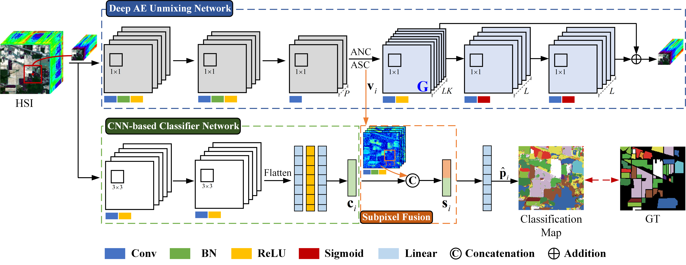

# DSNet

[Zhu Han](https://scholar.google.com/citations?user=AtmD3QUAAAAJ&hl=zh-CN&oi=sra), Jin Yang, [Lianru Gao](https://scholar.google.com/citations?user=La-8gLMAAAAJ&hl=zh-CN&oi=sra), [Zhiqiang Zeng](https://scholar.google.com/citations?user=rKfw-PkAAAAJ&hl=zh-CN), [Bing Zhang](https://scholar.google.com/citations?user=nHup8tQAAAAJ&hl=zh-CN), [Jocelyn Chanussot](http://jocelyn-chanussot.net/)

___________
This is a PyTorch implementation of the ["Dual-Branch Subpixel-Guided Network for Hyperspectral Image Classification"](https://ieeexplore.ieee.org/document/10570241) in IEEE Transactions on Geoscience and Remote Sensing. More specifically, it is detailed as follow.



**DSNet** includes deep AE unmixing network, CNN-based classifier network and subpixel fusion module. The deep AE unmixing network is designed by considering a general mixing decoder with physically nonlinear constraints, and further extract useful subpixel-level abundance information from the HSI in an unsupervised manner. The CNN-based classifier network extracts the spectral-spatial information within the HSI to obtain pixel-level class features. The subpixel fusion module aims at integrating the abundance information and class features to ensure high-quality information fusion and enhance model representation capability.

# 🌞 Overview

Deep learning (DL) has been widely applied into hyperspectral image (HSI) classification owing to its promising feature learning and representation capabilities. However, limited by the spatial resolution of sensors, existing DL-based classification approaches mainly focus on pixel-level spectral and spatial information extraction through complex network architecture design, while ignoring the existence of mixed pixels in actual scenarios. To tackle this difficulty, we propose a novel dual-branch subpixel-guided network for HSI classification, called **DSNet**, which automatically integrates subpixel information and convolutional class features by introducing a deep autoencoder unmixing architecture to enhance classification performance. DSNet is capable of fully considering physically nonlinear properties within subpixels and adaptively generating diagnostic abundances in an unsupervised manner to achieve more reliable decision boundaries for class label distributions. The subpixel fusion module is designed to ensure high-quality information fusion across pixel and subpixel features, further promoting stable joint classification. Experimental results on three benchmark datasets demonstrate the effectiveness and superiority of DSNet compared with state-of-the-art DL-based HSI classification approaches.

# 🔨 Usage

### Training
    
* `./demo.py` is the script for training DSNet on different hyperspectral datasets. The patch size can be changed according to input dataset.

```bash
python demo.py --dataset='Indian' --patches=7 --flag_test='train'
```

### Testing

* After training DSNet, the saved model is loaded to obtain final classification results.

```bash
python demo.py --dataset='Indian' --patches=7 --flag_test='test'
```

# ⭐ Citation

**Please kindly cite the papers if this code is useful and helpful for your research.**

Zhu Han, Jin Yang, Lianru Gao, Zhiqiang Zeng, Bing Zhang, Jocelyn Chanussot. Dual-Branch Subpixel-Guided Network for Hyperspectral Image Classification, IEEE Transactions on Geoscience and Remote Sensing, vol. 62, pp. 1-13, 2024, Art no. 5521813, doi: 10.1109/TGRS.2024.3418583.

    @ARTICLE{10570241,
      author={Han, Zhu and Yang, Jin and Gao, Lianru and Zeng, Zhiqiang and Zhang, Bing and Chanussot, Jocelyn},
      journal={IEEE Transactions on Geoscience and Remote Sensing}, 
      title={Dual-Branch Subpixel-Guided Network for Hyperspectral Image Classification}, 
      year={2024},
      volume={62},
      pages={1-13},
      doi={10.1109/TGRS.2024.3418583}
    }
    
Contact Information
---------------------
Zhu Han: hanzhu19@mails.ucas.ac.cn
